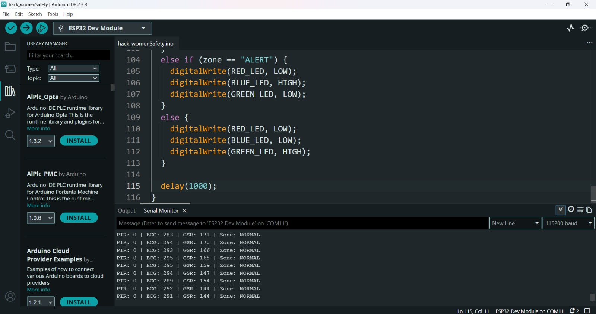
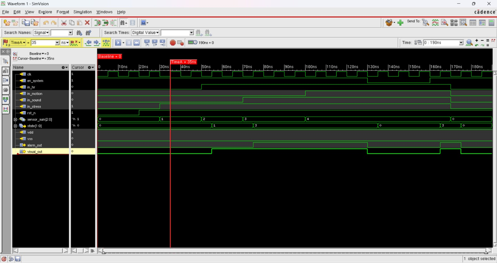
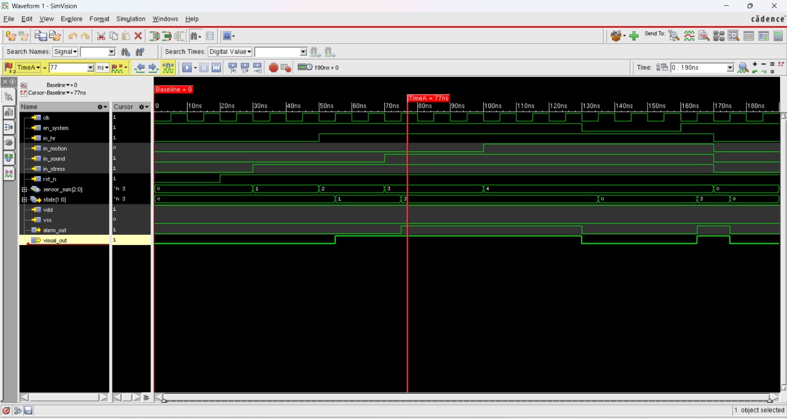
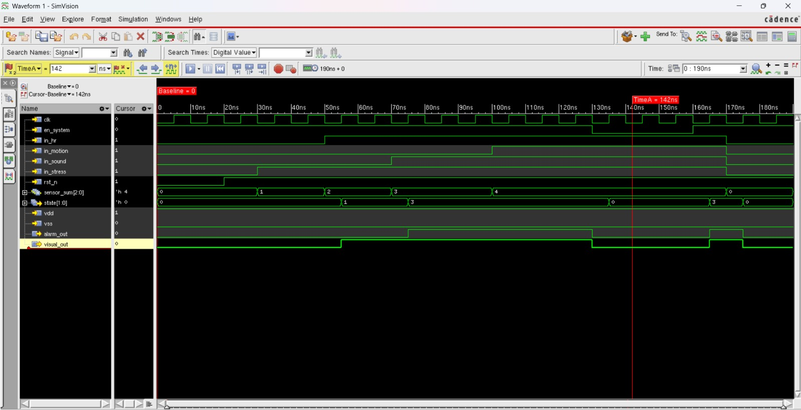
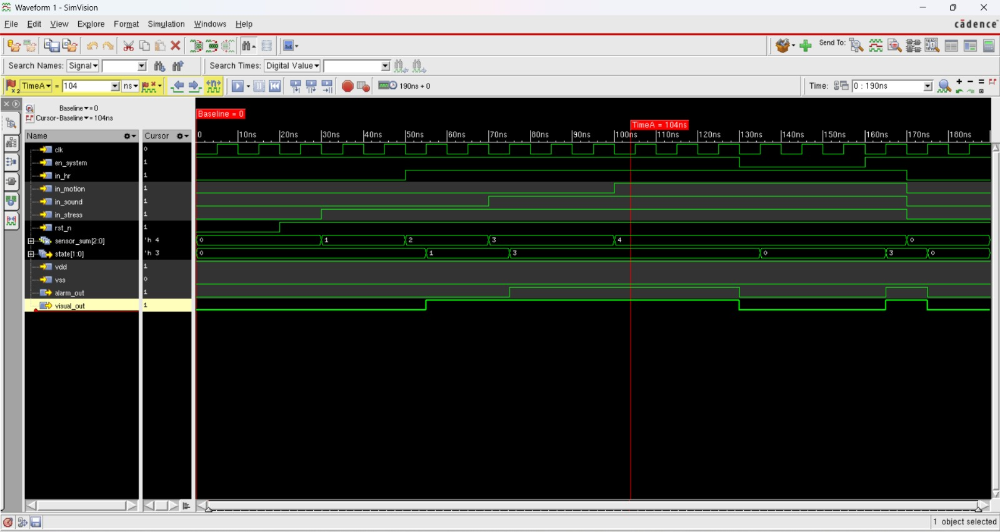
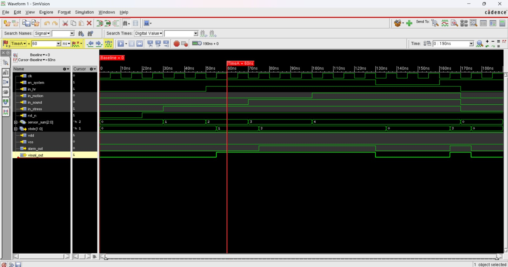
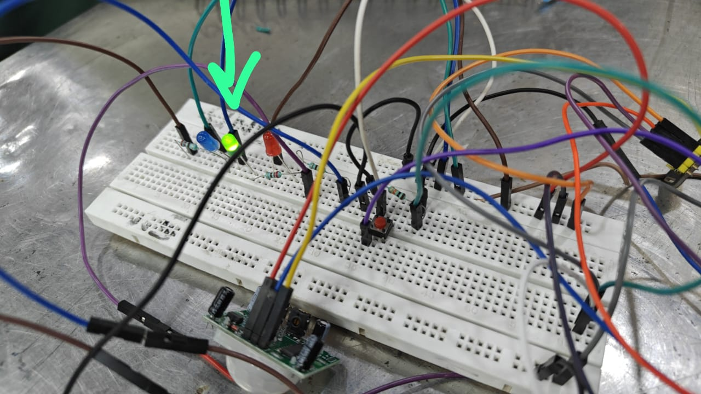
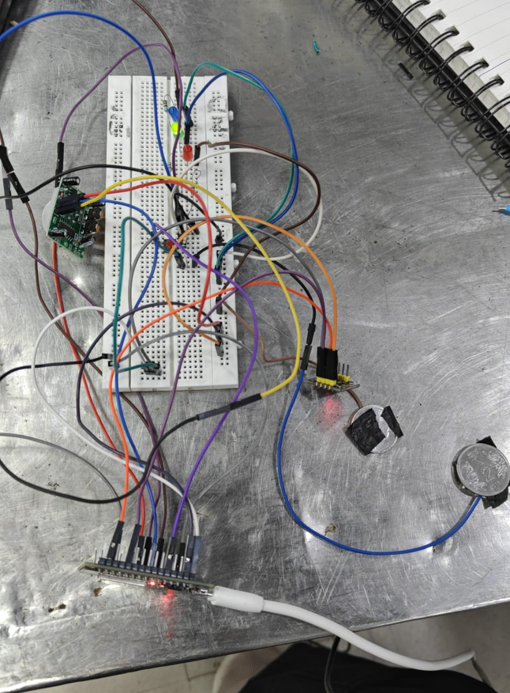

# AuraShield – Wearable Multi-Sensor Safety System

**FemTech Force**

---

## Problem Statement

Increasing concerns about personal safety in daily life.

Risk situations include:

* Travel / commuting
* Late-night outings
* Unknown environments

Existing solutions:

* Panic buttons (manual)
* Mobile apps (slow response)

Problem: No system that automatically detects danger.

---

## Solution

AuraShield is a wearable multi-sensor safety system that:

* Continuously monitors user condition
* Detects abnormal situations automatically
* Triggers alerts and location sharing

---

## System Components

### Biomedical Sensors

* GSR – Stress detection
* Heart Rate / ECG – Physiological monitoring

### Environmental Sensors

* Microphone – Sound anomalies
* PIR Sensor – Motion detection

### Processing

* ESP32 (real-time processing)

### Output

* GPS location sharing
* LED alerts (Safe / Alert / Danger)

---

## Working Principle

Flow:
Sensors → ESP32 → Processing → FSM → Alerts + GPS

* Continuous monitoring
* Data analysis
* Decision making

### FSM Logic

* SAFE → Normal
* ALERT → Suspicious
* DANGER → Threat detected

Based on combined sensor data.

---

## Architecture

* Sensor inputs connected to ESP32
* Analog and digital signal processing
* Communication via WiFi/Bluetooth
* GPS for real-time location tracking

---

## Implementation

### Hardware

* ESP32
* GSR (voltage divider)
* ECG / Heart Rate sensor
* PIR sensor
* Microphone sensor
* GPS module

### Software

* Arduino IDE
* Embedded C
* Threshold-based logic

---

## Innovation

* Predictive safety system
* Multi-sensor fusion
* Real-time autonomous decision-making

### Hybrid Approach

* Present: ESP32-based prototype
* Future: Custom VLSI chip design

---

## Impact

* Women safety
* Student protection
* Travel safety
* Emergency response
* Elderly monitoring

---

## Business Idea

### Product Forms

* Smart necklace
* Safety watch
* Wearable clip

### Market

* Personal safety technology
* Smart wearables
* IoT healthcare

---

## Future Scope

* AI/ML-based threat prediction
* Mobile app dashboard
* Cloud integration
* Miniaturized VLSI chip
* Smart city integration

---

## Output

Refer to the results folder for screenshots.

## Output Preview

